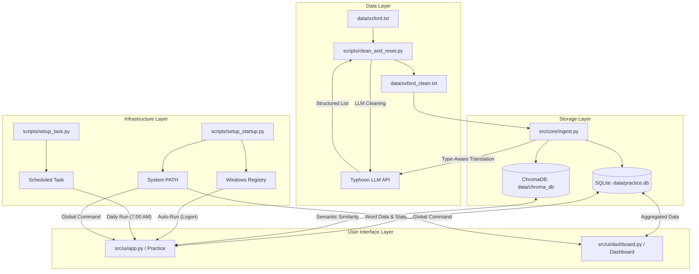

# English Practice CLI Application

## Purpose
This project is designed for tech-savvy individuals who spend their entire day at a computer but are too "lazy" (or busy!) to open a physical book to study. It aims to bridge the gap between daily work and language learning by integrating vocabulary practice directly into the computer's startup routine. With an interactive dashboard to measure progress, it turns a passive routine into an active learning session.

## Features
- **Semantic Similarity Distractors**: Powered by ChromaDB and Sentence-Transformers, the quiz provides semantically related Thai options (e.g., if the word is "Happy", it shows "Joyful" or "Glad" instead of random words).
- **Type-Aware Translations**: Powered by Typhoon LLM, the system understands the difference between parts of speech (e.g., *act* as a verb vs. *act* as a noun).
- **Interactive Dashboard**: A beautiful Streamlit dashboard with Plotly graphs to track your accuracy and identify words that need more focus.
- **Global Shortcuts**: Launch practice or the dashboard from any terminal using `Practice` or `Dashboard` commands.

## Project Architecture

The application follows a modular architecture consisting of five main layers: **Data Ingestion**, **Relational Storage**, **Vector Storage**, **Application Logic**, and **Infrastructure**.

### High-Level Architecture Diagram


## Project Structure

The project has been restructured for better scalability and maintainability:

```text
practice-english-application/
├── src/                # Source code
│   ├── core/           # Core logic (ingestion, OCR, utilities)
│   ├── database/       # Database management (SQLite & VectorDB)
│   └── ui/             # User interface (CLI app, dashboard)
├── scripts/            # Maintenance and setup scripts
├── tests/              # Unit and integration tests
├── data/               # Data files (DBs, backups, source files)
│   ├── backups/        # SQLite database backups
│   └── chroma_db/      # Vector database storage
├── .gemini/            # Agent activity logs and memory
├── Practice.bat        # Shortcut for practice session
├── Dashboard.bat       # Shortcut for dashboard
└── requirements.txt    # Project dependencies
```

## Component Interaction

### 1. The Data Pipeline (One-time setup)
- **`scripts/clean_and_reset.py`**: The orchestrator. It reads the messy `data/oxford.txt`, sends chunks to **Typhoon LLM** via `src/core/typhoon_utils.py` to fix OCR errors, and saves a perfectly formatted `data/oxford_clean.txt`.
- **`src/core/ingest.py`**: Takes the cleaned text, identifies unique words, and requests **Type-Aware Translations**. It populates **SQLite** for relational data and **ChromaDB** for semantic vectors.

### 2. Dual-Storage System
- **`src/database/db_manager.py`**: Manages the SQLite database for word metadata, levels, and user learning statistics (accuracy, logical day tracking).
- **`src/database/vector_manager.py`**: Manages the ChromaDB vector store. It uses `sentence-transformers` (`paraphrase-multilingual-MiniLM-L12-v2`) to generate embeddings for Thai translations, enabling semantic similarity search.

### 3. Practice & Logic (Daily use)
- **`src/ui/app.py`**: The core interactive CLI. It fetches words from the SQLite DB based on performance. It uses the `VectorManager` to generate "smart" distractors that are semantically similar in Thai, making the quiz more challenging and educational.

### 3. Insights & Visualization
- **`src/ui/dashboard.py`**: A **Streamlit** application that queries the database to generate interactive **Plotly** charts. It calculates accuracy trends over time and identifies the top 10 "trouble words" for you to focus on.

### 4. Integration & Convenience
- **`scripts/setup_startup.py`**: Connects the project to your operating system. It creates global batch file shortcuts (`Practice.bat`, `Dashboard.bat`) and adds the app to the Windows Registry for auto-run on logon. **Must be run within the `practice-english` environment.**
- **`scripts/setup_task.py`**: Ensures the app runs daily at 7:00 AM using Windows Task Scheduler and verifies the logon registry entry.

## Installation

### 1. Prerequisites
- Python 3.10 or higher.
- [Conda](https://docs.conda.io/en/latest/) (Recommended).
- A [Typhoon API Key](https://opentyphoon.ai/).

### 2. Setup Environment
```powershell
# Create and activate environment
conda create -n practice-english python=3.10
conda activate practice-english

# Install dependencies
pip install -r requirements.txt
```

### 3. Configuration
Create a `.env` file in the root directory:
```env
TYPHOON_API_KEY=your_api_key_here
```

### 4. Ingest Vocabulary
Run the cleaning script to process the Oxford 3000 list and populate your database:
```powershell
python scripts/clean_and_reset.py
```

### 5. Setup Global Commands and Startup
Activate your environment and run the setup scripts:
```powershell
conda activate practice-english
python scripts/setup_startup.py
python scripts/setup_task.py
```
*(Restarting terminal is required after this to enable global commands.)*

## Usage

### Daily Practice
Simply turn on your computer! If it's after 7 AM and you haven't practiced yet, the CLI will appear. To manually start or force a session from anywhere:
```powershell
Practice
```
Or from the root directory:
```powershell
./Practice.bat
```

### View Progress
To see your learning trends and word statistics:
```powershell
Dashboard
```
Or from the root directory:
```powershell
./Dashboard.bat
```

### List All Words
To see the full list of ingested vocabulary in the terminal:
```powershell
python scripts/list_words.py
```

---
*Happy Learning!*
